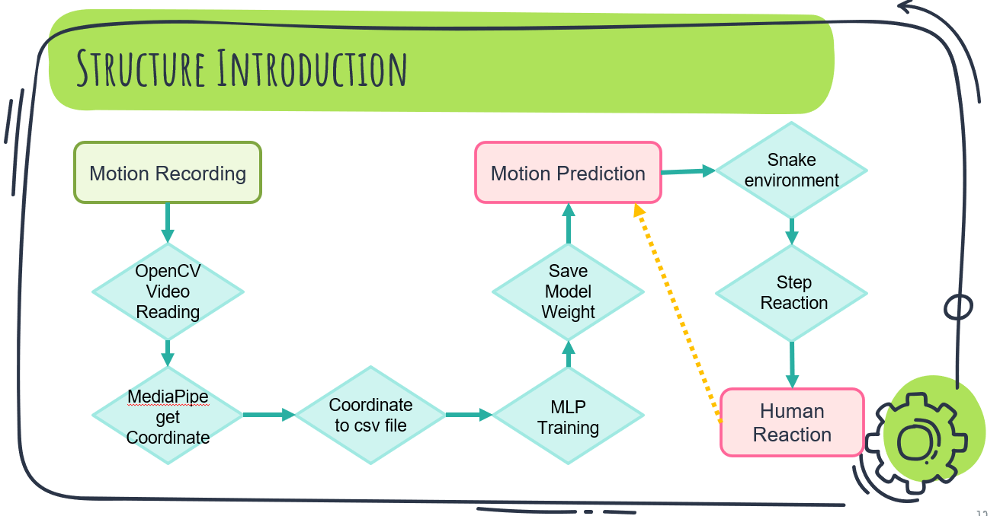

# README

## Using Posture Recognition to Play Snake Games

### Introduction
In this project, we leverage posture recognition technology to control the classic "Snake" game using body movements. This innovative approach allows players to engage in physical activity while enjoying the game, utilizing webcams that might otherwise go unused.

### Motivation
Let's go back two years. Do you remember what happened then? That's right! (^▽^) Two years ago, Taiwan was hit by the Covid-19 pandemic, forcing people to work or study from home. Most of us had to buy a webcam to attend online classes and meetings, so teachers on Teams wouldn’t feel lonely. However, after the pandemic, these webcams became obsolete. 

Our idea is to make these webcams useful again. 

Additionally, nowadays people spend a lot of time in front of computers. Many of us, if not most, neglect to exercise, which isn't healthy. With prices rising day by day, people are under a lot of stress. A small game can help people relax. So, our project aims to let you play games and exercise simultaneously using your unused webcam.

### Methodology
We don't need high-resolution webcams because they increase the file size of each frame. We used an RTX-3060 GPU to run the posture recognition.

#### Data Collection and Preparation
We recorded videos of four postures: left, right, up, and down. Mediapipe was used to recognize all human body features and convert these 33 data points into 3D spatial data. Each frame of the video was converted into a row of XYZ and visibility data, and manually labeled with the corresponding posture by Mediapipe.

#### Model Training
We used OpenCV to capture frame data from the recorded videos. Mediapipe recognized body joint data and outputted it to a CSV file. The corresponding postures were manually labeled, and an MLP (Multi-Layer Perceptron) model was trained with this data, saving the model weights.

#### Real-Time Posture Recognition
Next, we used the trained model to recognize the posture in real-time using a webcam. The system then sends direction commands to the game to change the snake’s direction.

### Results
The diagram below shows our model structure and training situation. It seems we don't need a very complex model to achieve good results. However, all test data came from the same person, so this doesn't truly demonstrate what happens when the model is applied to different people or minor movements.

We found that the model misclassifies data between endpoint postures when tested in different locations and camera angles. Due to the lack of data between endpoint postures and occasional frame drops, the model's performance was limited.

To address these issues, we used a 70% confidence threshold based on the softmax probability to reduce classification errors. Additionally, we employed a majority vote method to avoid misclassification by considering the most frequent action in three consecutive frames.

Below are some examples of misclassification before model adjustments. Clearly, the intervals between actions were misclassified.

In the final demonstration video, we showcased our adjustments and found that it performed well with different players. We believe these metrics are helpful for the model's growth.

### Mediapipe Overview
Mediapipe is a cross-platform framework developed by Google that provides high-fidelity, low-latency, and low-complexity solutions for processing perceptual data such as video, audio, and sensors. In this project, Mediapipe is used for real-time posture recognition by detecting and tracking human body landmarks.

### Demonstrations and Resources
- **Workflow Diagram**: The overall architecture and workflow of our project can be visualized in the "workflow.png" image.
- **Demo Video**: For a practical example of our project in action, please refer to our demonstration video.

[Demo Video](demo.mp4)

[YouTube Demo Video](https://youtu.be/tzlR8dmS088?si=AYr2ypYCvU9c_TM9)

